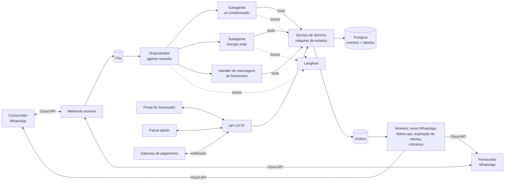
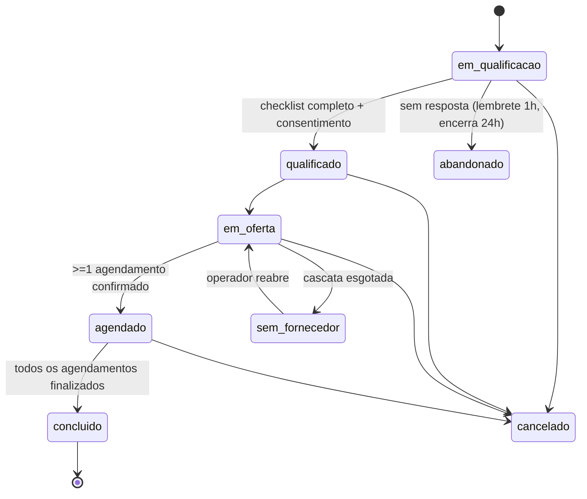

# Especificação técnica — Marketplace de serviços técnicos via WhatsApp

> Nome do produto: **[A DEFINIR]** (neste documento: "a plataforma").
> Versão do documento: 0.1 — 26/09/2026. Autor: Rafael (Simetech), com apoio do Claude.
> Público: o agente/dev que vai implementar. Leia a seção 1 inteira antes de escrever código.
> Tudo marcado como **[DECISÃO EM ABERTO]** precisa de confirmação do Rafael antes de ser implementado de forma definitiva — implemente de forma que a troca seja barata.

---

## 1. Contexto e decisões já tomadas

### 1.1 O que é

Um **marketplace de serviços técnicos operado por um agente de IA no WhatsApp**. O consumidor final manda mensagem para **um único número de WhatsApp da plataforma** ("preciso instalar um ar-condicionado dia 12", "quero orçamento de energia solar"). Um agente roteador entende a intenção e passa para um **subagente da categoria** (ar-condicionado, energia solar), que coleta os dados, qualifica o pedido, escolhe empresa(s) parceira(s), oferece o pedido à empresa pelo WhatsApp e confirma o agendamento com o consumidor.

As empresas parceiras (fornecedores) têm um **portal web** onde se cadastram, definem área e horários, veem pedidos, métricas, pagam e contratam prioridade.

Inspiração: Avoca (EUA, IA de atendimento para serviços técnicos) + modelo de marketplace tipo GetNinjas, com IA no lugar do formulário. Lançamento: **Catalão-GO**, depois outras cidades do interior.

### 1.2 Decisões de negócio

| # | Decisão | Consequência técnica |
|---|---|---|
| D1 | Não é app. O canal do consumidor é **só WhatsApp** (número da plataforma). | WhatsApp Cloud API oficial. Nada de app mobile para consumidor. |
| D2 | Fornecedor **não paga nada para entrar**. Paga **por visita agendada e confirmada** (o "lead entregue"). | O evento `AGENDAMENTO_CONFIRMADO` gera cobrança. Precisa de fluxo de contestação. |
| D3 | **Sem pagamento do consumidor pela plataforma** (por enquanto). | A conversão (serviço fechado) acontece fora do sistema e precisa ser rastreada por outros meios (seção 7). |
| D4 | **Prioridade paga**: fornecedor pode pagar para ter prioridade — mas **só entre fornecedores que passam no filtro de qualidade**, e só será vendida quando houver volume. | Prioridade é um peso no score de matching, aplicado depois do filtro de qualidade. Feature flag para ligar/desligar. |
| D5 | No início, distribuição em **rodízio** entre parceiros elegíveis (justiça > otimização). | Componente de "fairness" no score. |
| D6 | **Categoria padronizada/rápida (ar-condicionado)**: a plataforma escolhe 1 empresa e o consumidor confirma, com opção "ver outras opções". | `categorias.modo_selecao = 'automatico'`. |
| D7 | **Categoria de ticket alto (energia solar)**: oferecer **até 3 empresas** para orçamento. | `modo_selecao = 'multiplas'`, `max_fornecedores = 3`. Um pedido gera N agendamentos e N cobranças (valor por visita possivelmente menor — [DECISÃO EM ABERTO]). |
| D8 | **Máximo 3 opções** mostradas ao consumidor por vez. | Casa com o limite de 3 botões de resposta rápida do WhatsApp. |
| D9 | Fornecedor tem regras: responder oferta em até X minutos, aceitar ser avaliado, avisar indisponibilidade. | SLA de oferta com expiração e cascata para o próximo. |
| D10 | Reputação (nota, comparecimento) é diferencial contra o GetNinjas. | Métricas de fornecedor derivadas de eventos, visíveis no portal e usadas no matching. |
| D11 | Mostrar ao fornecedor o resultado que a plataforma gerou ("12 clientes, 10 visitas, 6 fechados, ~R$ 18 mil"). | Dashboard do fornecedor no portal. |

### 1.3 Decisões técnicas

| # | Decisão |
|---|---|
| T1 | **Postgres** como banco principal. **Log de eventos append-only** (`eventos`) é a fonte da verdade; estados e métricas são derivados. |
| T2 | **Máquina de estados no backend**, nunca no LLM. O agente só age via *tools* (funções) validadas pelo domínio. |
| T3 | **Langfuse** (self-hosted) para telemetria do agente: traces por mensagem, sessões por conversa, custo, scores, versionamento de prompts. |
| T4 | Portal do fornecedor + painel admin são web (responsivo, funciona bem no celular). |
| T5 | WhatsApp e portal compartilham **o mesmo backend e o mesmo banco**. Qualquer ação (ex.: aceitar oferta) pode vir de qualquer um dos dois canais e o efeito é o mesmo. |
| T6 | Processamento de webhook do WhatsApp **assíncrono e idempotente** (fila + chave de idempotência = `wamid`). |
| T7 | Stack preferida (domínio do Rafael): TypeScript/Node + React; Python aceitável para o agente. Ver seção 3.3. |

### 1.4 Restrições externas (Meta / WhatsApp / LGPD)

- **Janela de 24h**: responder ao consumidor dentro de 24h da última mensagem dele é mensagem de serviço, **gratuita** segundo a documentação oficial da Meta (verificar novamente antes do lançamento — há blogs citando mudança de cobrança a partir de 01/10/2026 que a página oficial não confirma).
- **Fora da janela** (follow-ups de D+3, D+7; notificações para fornecedor que não falou com a plataforma nas últimas 24h) só com **templates aprovados** (categoria *utility*), que são pagos (ordem de centavos por mensagem no Brasil).
- Consumidor vindo de anúncio **Click-to-WhatsApp**: janela gratuita de **72h** (Free Entry Point) se respondermos em até 24h. O webhook traz o objeto `referral` com o id do anúncio (`source_id`, `ctwa_clid`) — gravar.
- **Política de IA da Meta (desde 15/01/2026)**: proibido chatbot de IA *de uso geral*. Permitido agente de atendimento/qualificação/agendamento de um negócio. **O agente deve recusar educadamente assuntos fora do escopo** (não virar "pergunte qualquer coisa").
- **LGPD**: pedir consentimento explícito antes de compartilhar dados do consumidor com o fornecedor ("Posso enviar seu nome, telefone e endereço para a Empresa X fazer a visita?"). Registrar consentimento como evento. Fornecedor só vê telefone/endereço completo **depois de aceitar** a oferta. Suportar opt-out ("PARAR") e exclusão de dados.
- **Qualidade do número**: bloqueios/denúncias derrubam o *quality rating* do número na Meta. Não fazer marketing em massa pelo número operacional.

---

## 2. Glossário

| Termo | Significado |
|---|---|
| Consumidor / cliente | Pessoa que precisa do serviço e fala no WhatsApp da plataforma. |
| Fornecedor / parceiro | Empresa que executa o serviço (ex.: instaladora de ar-condicionado). |
| Técnico | Pessoa do fornecedor que vai até o local. Pode ter telefone diferente do dono. |
| Pedido | Uma necessidade de serviço de um consumidor, numa categoria. Entidade central. |
| Oferta | Tentativa de passar um pedido para um fornecedor (pode ser aceita, recusada ou expirar). |
| Agendamento | Visita marcada entre consumidor e fornecedor. **Agendamento confirmado = lead entregue = cobrável.** |
| Lead qualificado | Pedido com todos os campos obrigatórios da categoria + consentimento (checklist objetivo, não opinião). |
| Conversão / fechamento | O consumidor contratou o serviço com o fornecedor após a visita. |

---

## 3. Arquitetura

### 3.1 Visão geral



### 3.2 Componentes

1. **Webhook receiver** — recebe eventos da Cloud API (mensagens e status de entrega). Valida assinatura (`X-Hub-Signature-256`), grava a mensagem bruta, enfileira e responde 200 rápido. **Idempotência pelo `wamid`** (webhooks chegam duplicados e fora de ordem).
2. **Roteador de remetente** — decide se a mensagem é de um **consumidor** ou de um **fornecedor/técnico** (lookup do telefone em `fornecedor_usuarios`). Fornecedores têm fluxo próprio (aceitar/recusar oferta, confirmar visita, informar fechamento), majoritariamente por botões.
3. **Orquestrador (agente roteador)** — identifica a intenção/categoria e delega para o subagente. Recusa assuntos fora do escopo.
4. **Subagentes por categoria** — cada um com: prompt próprio, checklist de campos obrigatórios (vem de `categorias.schema_campos`), extração de dados de foto/áudio (etiqueta do aparelho, conta de luz), e as mesmas tools do domínio.
5. **Serviço de domínio** — única porta de escrita. Implementa a máquina de estados (seção 5), grava eventos, atualiza projeções, grava na outbox. Transação única: `evento + projeção + outbox` no mesmo commit.
6. **Workers** — consomem a outbox: enviar mensagens, agendar/expirar ofertas, disparar follow-ups, gerar cobranças e faturas, sincronizar com o gateway.
7. **API HTTP** — usada pelo portal e pelo painel admin.
8. **Portal do fornecedor** (seção 8.1) e **Painel admin** (seção 8.2).
9. **Langfuse** (seção 9).

### 3.3 Stack sugerida — [DECISÃO EM ABERTO] para confirmar

- Backend: **TypeScript + Node** (NestJS ou Fastify). Agente: TypeScript (Vercel AI SDK / SDK do provedor) ou Python — manter no mesmo serviço se possível.
- Banco: **Postgres 16 + PostGIS** (área de atendimento por raio/bairro).
- Fila: **pg-boss** (fila em cima do próprio Postgres — menos infraestrutura) ou Redis + BullMQ se o volume exigir.
- Front: **React** (Next.js) para portal + admin, mesma base, rotas separadas por papel.
- Auth do portal: login por **código enviado no WhatsApp** do fornecedor (o fornecedor já está no WhatsApp; evita senha) + e-mail como alternativa.
- Arquivos (fotos, contas de luz, PDFs de orçamento): object storage compatível com S3.
- LLM: modelo via API com *tool calling* e visão (para fotos) e transcrição de áudio. **[DECISÃO EM ABERTO]** provedor.
- Pagamento: gateway brasileiro com Pix, boleto, cartão, assinatura e webhooks (candidatos: Asaas, Pagar.me, Iugu, Mercado Pago). **[DECISÃO EM ABERTO]**
- Observabilidade de aplicação (além do Langfuse): logs estruturados + Sentry ou equivalente.
- **[DECISÃO EM ABERTO]**: reaproveitar partes do **Sirvase** (SaaS multi-tenant de pedidos por WhatsApp da Simetech) — camada de integração com a Cloud API, envio de templates, multi-tenant.

---

## 4. Fluxos principais

### 4.1 Consumidor — ar-condicionado (modo automático)

1. Consumidor: "Oi, preciso instalar um ar dia 12". Evento `CONVERSA_INICIADA` (com origem, ver 7.5).
2. Orquestrador → subagente ar-condicionado.
3. Subagente coleta checklist (ver 6.3): tipo de serviço, BTUs ou foto da etiqueta do aparelho, endereço (bairro dentro da área), data/turno desejado, nome. Aceita **texto, áudio e foto**. Cada campo coletado → `CAMPO_COLETADO`.
4. **Resumo estruturado com confirmação** (obrigatório antes de qualificar): "Instalação de split 12.000 BTUs, Bairro X, sexta 12/10 à tarde. Está certo?" [Sim] [Corrigir]. Evita erro de interpretação do LLM ("sexta que vem").
5. Consentimento LGPD → `CONSENTIMENTO_REGISTRADO`. Pedido → `PEDIDO_QUALIFICADO`.
6. Matching (seção 6.1) escolhe o fornecedor nº 1 → `OFERTA_ENVIADA` (template para o fornecedor com botões [Aceitar] [Recusar] [Propor outro horário]). Consumidor recebe: "Estou confirmando com uma empresa, te retorno em até 15 min."
7. Fornecedor aceita → `OFERTA_ACEITA`. Consumidor recebe: "A Empresa X (nota 4,8, 37 serviços) pode ir sexta 12/10 às 14h. Confirma?" [Confirmar] [Ver outras opções].
   - Recusa/expira → `OFERTA_RECUSADA`/`OFERTA_EXPIRADA` → próximo fornecedor (cascata). Após N tentativas sem sucesso → `PEDIDO_SEM_FORNECEDOR` + handoff humano.
8. Consumidor confirma → **`AGENDAMENTO_CONFIRMADO`** → gera **cobrança** (seção 10) + envia ao fornecedor os dados completos do cliente + gera **código de visita** (seção 7.2) enviado só ao consumidor.
9. Lembretes: véspera e 2h antes para os dois lados.
10. Pós-visita: seção 7.

### 4.2 Consumidor — energia solar (modo múltiplas)

Igual ao 4.1, com diferenças:
- Checklist: foto da conta de luz (extrair consumo kWh, distribuidora, classe), endereço, tipo de telhado + foto, interesse em financiamento.
- Pergunta: "Quer receber orçamento de até 3 empresas da região?" [Sim, até 3] [Só 1].
- Oferta em paralelo para até 3 fornecedores. Cada aceite gera um agendamento separado (visitas em horários diferentes) e uma cobrança separada.
- Follow-up de fechamento mais longo (decisão de compra de solar leva semanas): D+7, D+21, D+45.

### 4.3 Fornecedor — pelo WhatsApp

- Recebe oferta (template utility): "Novo pedido #A7K2 — Instalação split 12k BTUs — Bairro X — sex 12/10 tarde. Aceita?" [Aceitar] [Recusar] [Outro horário].
- Antes de aceitar vê só: categoria, bairro, data, detalhes técnicos. **Não vê telefone nem endereço completo.**
- Depois de aceitar e o consumidor confirmar: recebe nome, telefone, endereço, fotos.
- Após a visita: confirma com o **código de visita** ou pelos botões (seção 7).
- Tudo que dá para fazer pelo WhatsApp também dá pelo portal.

### 4.4 Handoff humano

Gatilhos: consumidor pede humano; agente falha 2x no mesmo campo; nenhum fornecedor aceita; reclamação; contestação. Evento `HANDOFF_HUMANO`; conversa entra na fila do painel admin; agente fica pausado nessa conversa até o operador devolver.

---

## 5. Máquinas de estado

### 5.1 Pedido



O **resultado comercial** (fechado/perdido) não é estado do pedido — fica em `conversoes`, por agendamento (em solar um pedido tem vários fornecedores).

### 5.2 Oferta
`enviada → aceita | recusada | expirada | cancelada` (cancelada quando outro fornecedor já fechou no modo automático).

### 5.3 Agendamento
```
proposto → confirmado → realizado
                     ↘ remarcado → confirmado
                     ↘ cancelado_cliente | cancelado_fornecedor
                     ↘ no_show_cliente | no_show_fornecedor
```
`realizado` exige evidência (seção 7.2). Transições inválidas são rejeitadas pelo domínio.

---

## 6. Regras de domínio

### 6.1 Matching (escolha do fornecedor)

**Filtro (elegibilidade)** — todos obrigatórios:
- Fornecedor `ativo`, não suspenso por inadimplência.
- Executa **o serviço** classificado (`fornecedor_servicos`, seção 6.4) e cobre o endereço (bairro listado ou dentro do raio — PostGIS).
- Disponível na data/turno (disponibilidade semanal − bloqueios − agendamentos existentes).
- Passa no **filtro de qualidade**: nota ≥ limite **e** comparecimento ≥ limite (fornecedor novo sem histórico entra com valores neutros durante as primeiras N visitas).

**Score** (pesos configuráveis em tabela, não hardcoded):
```
score = w_nota * nota_norm
      + w_aceite * taxa_aceite
      + w_comparec * taxa_comparecimento
      - w_tempo * tempo_resposta_norm
      + w_fair * fairness            -- menos pedidos recebidos nos últimos 7 dias = maior
      + w_prior * boost_prioridade   -- só se assinatura de prioridade ativa (D4)
```
- Grave **o breakdown do score** em `ofertas.motivo_selecao` (jsonb). Serve para auditoria e para explicar ao fornecedor por que recebeu mais ou menos pedidos.
- Empate → rodízio.
- Feature flag `prioridade_paga_ativa` (desligada no lançamento).

### 6.2 SLA de oferta
- Expiração padrão: **15 min** em horário comercial [DECISÃO EM ABERTO], configurável por categoria.
- Fora do horário do fornecedor: oferta vai para o primeiro horário comercial dele, ou pula para outro fornecedor se o consumidor tiver urgência.
- Após N (padrão 3) ofertas sem aceite → `PEDIDO_SEM_FORNECEDOR` + handoff.

### 6.3 Checklist de qualificação por categoria

Checklist do pedido = `campos_comuns` da categoria + `campos_obrigatorios` de cada serviço classificado (taxonomia, seção 6.4). `categorias.schema_campos` guarda o JSON Schema de validação de cada campo (tipos, formatos, valores permitidos). Visão resumida:

```json
{
  "ar_condicionado": {
    "obrigatorios": ["tipo_servico", "potencia_btu_ou_foto", "endereco", "data_desejada", "turno", "nome"],
    "tipo_servico": ["instalacao", "manutencao", "limpeza", "conserto", "desinstalacao"],
    "opcionais": ["marca", "ja_possui_aparelho", "altura_instalacao", "observacoes"]
  },
  "energia_solar": {
    "obrigatorios": ["foto_conta_luz", "endereco", "tipo_telhado", "nome"],
    "opcionais": ["foto_telhado", "interesse_financiamento", "consumo_kwh_informado"]
  }
}
```
Qualificado = todos os obrigatórios presentes e validados + consentimento. **Nada de "o agente acha que está qualificado".**

### 6.4 Taxonomia de serviços (JSON de classificação)

O pedido é classificado em **dois níveis**: `categoria` (ar_condicionado, energia_solar) → `servico` (instalação, limpeza, conserto…). A taxonomia fica versionada em um arquivo `taxonomia_servicos.json` no repositório, é carregada na tabela `servicos` por um seed/migration e é usada por três partes do sistema:
1. O **orquestrador/subagente** para classificar a mensagem do consumidor (os sinônimos entram no prompt e/ou em busca por similaridade).
2. O **matching**: o fornecedor marca no portal quais *serviços* faz, não só a categoria (ex.: faz instalação mas não faz conserto de placa eletrônica).
3. As **métricas e preços**: preço da visita pode variar por serviço (`preco_visita_centavos` do serviço sobrescreve o da categoria).

**Regras de classificação**
- O agente devolve `{categoria, servico, confianca (0–1), justificativa}` via tool `classificar_servico`.
- `confianca >= 0.8` → segue. Entre `0.5` e `0.8` → **pergunta de desambiguação** com até 3 botões gerados a partir dos candidatos ("É instalação de um aparelho novo ou conserto de um que já está instalado?"). `< 0.5` → pergunta aberta; se falhar 2x → handoff.
- Um pedido pode ter **mais de um serviço** da mesma categoria (ex.: desinstalar + instalar) → `pedidos.servicos` é lista; o primeiro é o principal para matching e preço.
- Pedido fora da taxonomia → evento `SERVICO_NAO_MAPEADO` com o texto original. Esses registros alimentam a evolução da taxonomia (revisados no admin).
- Toda mudança na taxonomia incrementa `versao`; o pedido grava a `versao_taxonomia` usada.

**Formato (`taxonomia_servicos.json`)** — exemplo inicial:

```json
{
  "versao": 1,
  "categorias": [
    {
      "slug": "ar_condicionado",
      "nome": "Ar-condicionado",
      "modo_selecao": "automatico",
      "max_fornecedores": 1,
      "campos_comuns": ["endereco", "data_desejada", "turno", "nome"],
      "servicos": [
        {
          "slug": "instalacao",
          "nome": "Instalação",
          "sinonimos": ["instalar", "colocar ar", "montar o split", "comprei um ar", "instalação de split"],
          "campos_obrigatorios": ["potencia_btu_ou_foto", "tipo_aparelho", "ja_possui_aparelho", "andar_ou_altura"],
          "campos_opcionais": ["marca", "distancia_condensadora_m", "precisa_infra_eletrica"],
          "ticket": "medio",
          "duracao_estimada_min": 180
        },
        {
          "slug": "limpeza_higienizacao",
          "nome": "Limpeza / higienização",
          "sinonimos": ["limpeza", "higienizar", "manutenção preventiva", "ar com cheiro", "ar pingando"],
          "campos_obrigatorios": ["quantidade_aparelhos", "potencia_btu_ou_foto"],
          "campos_opcionais": ["ultima_limpeza"],
          "ticket": "baixo",
          "duracao_estimada_min": 60,
          "recorrente_meses": 6
        },
        {
          "slug": "conserto",
          "nome": "Conserto / diagnóstico",
          "sinonimos": ["não gela", "parou", "fazendo barulho", "pisca a luz", "vazando água", "deu defeito"],
          "campos_obrigatorios": ["sintoma", "potencia_btu_ou_foto"],
          "campos_opcionais": ["marca", "idade_aparelho", "video_ou_foto_defeito"],
          "ticket": "medio",
          "duracao_estimada_min": 90
        },
        {
          "slug": "carga_gas",
          "nome": "Carga de gás",
          "sinonimos": ["recarga de gás", "completar gás", "gás acabou"],
          "campos_obrigatorios": ["potencia_btu_ou_foto"],
          "ticket": "baixo",
          "duracao_estimada_min": 60
        },
        {
          "slug": "desinstalacao",
          "nome": "Desinstalação / mudança",
          "sinonimos": ["tirar o ar", "desinstalar", "vou mudar", "trocar de lugar"],
          "campos_obrigatorios": ["quantidade_aparelhos", "reinstalar_em_outro_local"],
          "ticket": "baixo",
          "duracao_estimada_min": 90
        },
        {
          "slug": "pmoc",
          "nome": "Contrato de manutenção (PMOC)",
          "sinonimos": ["pmoc", "contrato de manutenção", "manutenção da empresa", "laudo de ar-condicionado"],
          "campos_obrigatorios": ["tipo_estabelecimento", "quantidade_aparelhos", "cnpj"],
          "ticket": "alto",
          "b2b": true
        }
      ]
    },
    {
      "slug": "energia_solar",
      "nome": "Energia solar",
      "modo_selecao": "multiplas",
      "max_fornecedores": 3,
      "campos_comuns": ["endereco", "nome"],
      "servicos": [
        {
          "slug": "projeto_instalacao",
          "nome": "Projeto e instalação de sistema",
          "sinonimos": ["placa solar", "energia solar", "orçamento de solar", "baixar a conta de luz", "painel solar"],
          "campos_obrigatorios": ["foto_conta_luz", "tipo_telhado", "tipo_imovel"],
          "campos_opcionais": ["foto_telhado", "interesse_financiamento", "consumo_kwh_informado"],
          "ticket": "alto",
          "duracao_estimada_min": 60
        },
        {
          "slug": "ampliacao",
          "nome": "Ampliação de sistema existente",
          "sinonimos": ["aumentar as placas", "ampliar o sistema", "colocar mais placa"],
          "campos_obrigatorios": ["foto_conta_luz", "potencia_atual_kwp_ou_qtd_placas"],
          "ticket": "alto"
        },
        {
          "slug": "limpeza_placas",
          "nome": "Limpeza de placas",
          "sinonimos": ["lavar placa", "limpar painel", "placa suja", "geração caiu"],
          "campos_obrigatorios": ["quantidade_placas", "tipo_telhado"],
          "ticket": "baixo",
          "recorrente_meses": 6,
          "modo_selecao_override": "automatico"
        },
        {
          "slug": "manutencao_inversor",
          "nome": "Manutenção / inversor com defeito",
          "sinonimos": ["inversor apitando", "parou de gerar", "erro no inversor", "não está gerando"],
          "campos_obrigatorios": ["sintoma", "foto_inversor"],
          "ticket": "medio",
          "modo_selecao_override": "automatico"
        }
      ]
    }
  ]
}
```

Nota: `modo_selecao_override` permite que serviços simples dentro de uma categoria de ticket alto (limpeza de placas) usem seleção automática em vez de 3 orçamentos.

### 6.5 Deduplicação
Mesmo telefone + mesma categoria + pedido aberto nos últimos 7 dias → continuar o pedido existente em vez de criar outro (evita cobrar o fornecedor duas vezes).

---

## 7. Rastreamento fora da conversa (o ponto mais frágil)

Depois do `AGENDAMENTO_CONFIRMADO`, a visita e o fechamento acontecem **no mundo físico**. Estratégia em camadas, da mais simples à mais robusta. **Implementar 7.1 a 7.4 no MVP; 7.6 e 7.7 ficam para depois.**

### 7.1 Pergunta dupla e cruzamento (MVP)
- **Horário da visita + 2h**, para o consumidor: "O técnico da Empresa X apareceu?" [Sim] [Não apareceu] [Remarcamos]. Para o fornecedor: "Visita #A7K2 realizada?" [Sim] [Cliente não estava] [Remarcada].
- Respostas batem → registra. Não batem → `DIVERGENCIA_DETECTADA` → fila de revisão.
- Consumidor tem incentivo para responder: **garantia** "se o técnico não aparecer, arranjamos outro".

### 7.2 Código de visita (MVP — recomendado)
- No `AGENDAMENTO_CONFIRMADO`, gerar um **código de 4 dígitos** enviado **só ao consumidor**. Armazenar hash.
- O técnico pede o código ao cliente e envia no WhatsApp da plataforma (ou digita no portal) → `VISITA_CONFIRMADA_CODIGO`. Mesma lógica do código de entrega do iFood.
- É a **prova mais forte e barata** de que a visita aconteceu. Visita confirmada por código conta mais para a reputação do fornecedor, o que dá a ele incentivo para usar.

### 7.3 Check-in por localização (MVP opcional)
- O técnico compartilha a localização atual no WhatsApp ao chegar. Comparar com o geocode do endereço (tolerância ~200 m) → `CHECKIN_TECNICO` com distância.
- Útil para medir pontualidade (chegou no horário?).

### 7.4 Follow-up de fechamento (MVP)
- Consumidor: D+3 e D+7 (solar: D+7, D+21, D+45): "Fechou o serviço com a Empresa X?" [Sim] [Ainda decidindo] [Não]. Se "Não" → motivo [Preço] [Prazo] [Fechei com outra] [Desisti]. Se "Sim" → nota de 1 a 5.
- Fornecedor: "Pedido #A7K2 fechou?" [Sim] [Não] [Em negociação] + valor opcional.
- Mensagens fora da janela de 24h exigem **templates utility aprovados** (custo por mensagem).
- Como a cobrança é por agendamento e não por comissão, o fornecedor **não tem incentivo para mentir** sobre fechamento.
- `conversoes.fonte` e `conversoes.confianca` registram de onde veio a informação (ver 11).

### 7.5 Origem do consumidor (MVP)
- Links `wa.me` por canal com texto pré-preenchido contendo código: `Oi! Quero um orçamento (IG01)`. Tabela `canais_origem` mapeia código → canal/campanha/custo.
- Anúncio Click-to-WhatsApp: gravar `referral.source_id` e `ctwa_clid` do webhook.
- Sem código → o agente pergunta no fim: "Como você conheceu a gente?"

### 7.6 Orçamento pela plataforma (fase 2 — melhor sinal de conversão sem pagamento)
- Dar ao fornecedor um **gerador de orçamento grátis** no portal/WhatsApp (PDF com a logo dele). O orçamento é enviado ao consumidor **pelo número da plataforma** com botões [Aceitar] [Recusar] [Tenho dúvida].
- Captura valor e aceite de forma estruturada (`ORCAMENTO_ENVIADO`, `ORCAMENTO_ACEITO`). O fornecedor usa porque ganha uma ferramenta; você ganha o dado.

### 7.7 Pagamento pela plataforma (fase 3 — sinal definitivo, mais complexo)
- Hoje fora do escopo (D3). Se um dia entrar: Pix com **split** (gateway repassa ao fornecedor e retém a taxa), parcelamento, garantia. Dá 100% de rastreio de conversão e permite comissão. Complexidade: subconta por fornecedor, conciliação, nota fiscal, disputas.

### 7.8 Detecção estatística (fase 2)
- Comparar taxa de fechamento declarada pelo fornecedor x declarada pelos consumidores. Diferença grande → alerta no admin.

### 7.9 Descartado
- Número virtual intermediário para ligações (call tracking): caro, atrito, e o técnico liga do celular pessoal de qualquer jeito.

---

## 8. Telas

### 8.1 Portal do fornecedor (web responsivo)

| Área | Funcionalidades |
|---|---|
| Cadastro / onboarding | Dados da empresa (CNPJ/CPF), responsável, WhatsApp, categorias, **área de atendimento** (bairros ou raio no mapa), **horários** semanais e bloqueios, aceite dos termos (regras D9, cobrança, contestação), usuários da equipe (dono, atendente, técnico). |
| Pedidos | Ofertas pendentes (aceitar/recusar/propor horário — mesmo efeito do WhatsApp), agenda de visitas, detalhe do pedido (fotos, dados), confirmar visita com código, informar resultado (fechado/valor/perdido). |
| Orçamentos (fase 2) | Gerar e enviar orçamento pela plataforma. |
| Desempenho | Pedidos recebidos, taxa de aceite, tempo médio de resposta, comparecimento, fechamentos, valor estimado gerado, nota e comentários, posição relativa ("você está entre os 30% mais bem avaliados"). |
| Financeiro | Cobranças por visita, faturas, pagamento (Pix/boleto/cartão via gateway), histórico, **contestar cobrança** (até 48h). |
| Plano de prioridade | Contratar/cancelar assinatura de prioridade (quando a feature estiver ligada), explicação clara de que prioridade não fura o filtro de qualidade. |
| Notificações | Preferências (WhatsApp para dono e/ou técnico). |

Permissões: usuário do fornecedor só vê dados do próprio fornecedor (**Row Level Security no Postgres** por `fornecedor_id`). Técnico vê só as próprias visitas.

### 8.2 Painel admin (Rafael / operação)

- Fila de handoff humano (assumir conversa, responder, devolver ao agente).
- Pedidos com linha do tempo completa de eventos (e link para o trace no Langfuse).
- Fila de revisão: divergências, contestações, pedidos sem fornecedor.
- Fornecedores: aprovar cadastro, suspender, ajustar limites e pesos do matching.
- Métricas do negócio (seção 11) e custos (anúncios, LLM, WhatsApp).
- Configuração: categorias, checklists, SLAs, pesos, preços por visita, feature flags, templates.

### 8.3 Integração WhatsApp ↔ portal
- Uma única API de domínio. Aceitar oferta via botão do WhatsApp ou via portal chama o mesmo comando `aceitar_oferta(oferta_id, ator)`.
- Mudanças refletem em tempo real no portal (SSE/WebSocket ou polling curto).
- Link para o portal nas mensagens ao fornecedor ("ver detalhes"), com token de acesso de curta duração.

---

## 9. Telemetria do agente — Langfuse

- **Self-hosted** (Docker). Dados de conversas contêm dados pessoais → não mandar para serviço de terceiros sem avaliar LGPD.
- **Trace** por mensagem recebida processada pelo agente. **Session id** = `conversa_id`. **User id** = `cliente_id` (UUID, **nunca o telefone**).
- Registrar em cada trace: modelo, prompt (via **Prompt Management** do Langfuse, com versão), tool calls e resultados, tokens, custo, latência, categoria detectada, `pedido_id`.
- **Mascarar dados pessoais** (telefone, CPF, endereço) antes de enviar (função de mascaramento do SDK).
- **Scores** automáticos por trace/sessão: `qualificou` (0/1), `handoff` (0/1), `campos_corrigidos_pelo_cliente` (nº), `tempo_ate_qualificar`, `fora_do_escopo_recusado`.
- Gravar `langfuse_trace_id` em `mensagens` e `langfuse_session_id` em `conversas` → link direto do painel admin para o trace.
- **LLM-as-a-judge** (avaliadores do Langfuse rodando sobre amostra dos traces, com um modelo diferente do que atende):
  - `classificacao_correta`: dado o texto original do cliente e a taxonomia, a categoria/serviço escolhidos estão corretos? (0/1 + justificativa)
  - `qualificacao_completa`: os campos obrigatórios do serviço foram coletados sem perguntas redundantes?
  - `tom_e_escopo`: o agente foi claro, educado e recusou temas fora do escopo?
  - Divergência entre o judge e a classificação → trace marcado para revisão humana no admin; casos confirmados viram exemplos no dataset.
- **Datasets**: conversas que falharam (handoff, correção do cliente) viram casos de teste para avaliar novas versões de prompt antes de publicar.

---

## 10. Cobrança

- Evento gerador: `AGENDAMENTO_CONFIRMADO` → `cobrancas` (tipo `visita`, valor = preço da categoria vigente no momento; grava o preço, não referencia).
- **Contestação** até 48h após a visita agendada (motivos: número errado, fora da área, cliente desistiu antes da visita, duplicado). Aprovada → `estornada`.
- No-show do **consumidor** comprovado → estorno automático [DECISÃO EM ABERTO].
- Modelo de cobrança — **[DECISÃO EM ABERTO]**:
  - (a) **Pré-pago por créditos** (como as moedas do GetNinjas): sem inadimplência, mas atrito no início.
  - (b) **Pós-pago** com fatura semanal/mensal: menos atrito, risco de calote → suspender ofertas se fatura vencida há X dias (`FORNECEDOR_SUSPENSO`).
  - Sugestão: pós-pago nos primeiros meses para facilitar entrada; créditos depois.
- Assinatura de prioridade: recorrência pelo gateway; status sincronizado por webhook.
- Todo valor em **centavos (bigint)**. Nunca float.

---

## 11. Métricas (todas derivadas de `eventos`)

**Por fornecedor**
- Pedidos ofertados, taxa de aceite, tempo médio de resposta à oferta
- Taxa de comparecimento (visitas realizadas ÷ agendamentos confirmados), % com código de visita
- Taxa de fechamento (fechados ÷ realizados), ticket médio, valor total estimado gerado
- Nota média, nº de avaliações, contestações abertas/aprovadas
- Receita gerada para a plataforma

**Por consumidor / canal de origem**
- Conversas → pedidos qualificados → agendados (funil com taxa de cada etapa)
- Etapa de abandono (em que campo parou)
- Custo por pedido qualificado e por agendamento, por canal (usa `canais_origem.custo`)
- Recorrência (voltou para outro pedido)

**Do negócio**
- Agendamentos cobráveis/semana, receita/semana
- Custo por pedido = anúncio + LLM (Langfuse) + WhatsApp (templates) → margem por pedido
- Tempo médio da primeira mensagem até o agendamento
- % pedidos sem fornecedor (sinal de falta de oferta numa categoria/bairro)

**Confiança da conversão** (`conversoes.confianca`):
`alta` = orçamento aceito na plataforma ou cliente + fornecedor concordam · `media` = só um lado informou · `baixa` = inferido / sem resposta.

Implementação: views/materialized views sobre `eventos` e tabelas de projeção; atualizar materialized views por job periódico.

---

## 12. Modelo de dados (Postgres 16 + PostGIS)

> Validado em 26/09/2026: o DDL abaixo executa sem erros em Postgres 16 (teste feito com os tipos `geography` trocados por `text`, pois o ambiente de teste não tinha PostGIS); o trigger append-only de `eventos` bloqueia UPDATE corretamente. Transformar em migrations versionadas (ex.: node-pg-migrate, Drizzle ou Prisma migrate) na implementação.

Convenções: PK `uuid` (`gen_random_uuid()`), exceto `eventos` (`bigint identity`, ordenação global). Datas `timestamptz`. Dinheiro em centavos `bigint`. Estados como `text` + `CHECK` (mais fácil de migrar que ENUM). `criado_em`/`atualizado_em` em todas as tabelas mutáveis.

```sql
CREATE EXTENSION IF NOT EXISTS pgcrypto;
CREATE EXTENSION IF NOT EXISTS postgis;

-- ============ Catálogo ============
CREATE TABLE cidades (
  id            uuid PRIMARY KEY DEFAULT gen_random_uuid(),
  nome          text NOT NULL,
  uf            char(2) NOT NULL,
  codigo_ibge   int UNIQUE,
  ativa         boolean NOT NULL DEFAULT false
);

CREATE TABLE bairros (
  id         uuid PRIMARY KEY DEFAULT gen_random_uuid(),
  cidade_id  uuid NOT NULL REFERENCES cidades(id),
  nome       text NOT NULL,
  poligono   geography(MultiPolygon, 4326),
  UNIQUE (cidade_id, nome)
);

CREATE TABLE categorias (
  id                    uuid PRIMARY KEY DEFAULT gen_random_uuid(),
  slug                  text UNIQUE NOT NULL,            -- 'ar_condicionado', 'energia_solar'
  nome                  text NOT NULL,
  modo_selecao          text NOT NULL CHECK (modo_selecao IN ('automatico','multiplas')),
  max_fornecedores      int  NOT NULL DEFAULT 1 CHECK (max_fornecedores BETWEEN 1 AND 3),
  preco_visita_centavos bigint NOT NULL,
  sla_oferta_min        int  NOT NULL DEFAULT 15,
  max_tentativas_oferta int  NOT NULL DEFAULT 3,
  schema_campos         jsonb NOT NULL,                  -- checklist (seção 6.3)
  followups_dias        int[] NOT NULL DEFAULT '{3,7}',
  ativa                 boolean NOT NULL DEFAULT true,
  criado_em             timestamptz NOT NULL DEFAULT now(),
  atualizado_em         timestamptz NOT NULL DEFAULT now()
);

CREATE TABLE servicos (                              -- carregada de taxonomia_servicos.json
  id                    uuid PRIMARY KEY DEFAULT gen_random_uuid(),
  categoria_id          uuid NOT NULL REFERENCES categorias(id),
  slug                  text NOT NULL,
  nome                  text NOT NULL,
  sinonimos             text[] NOT NULL DEFAULT '{}',
  campos_obrigatorios   text[] NOT NULL DEFAULT '{}',
  campos_opcionais      text[] NOT NULL DEFAULT '{}',
  ticket                text CHECK (ticket IN ('baixo','medio','alto')),
  b2b                   boolean NOT NULL DEFAULT false,
  duracao_estimada_min  int,
  recorrente_meses      int,                          -- p/ lembretes de manutenção (fase 2)
  modo_selecao_override text CHECK (modo_selecao_override IN ('automatico','multiplas')),
  preco_visita_centavos bigint,                       -- null = usa o da categoria
  versao_taxonomia      int NOT NULL,
  ativo                 boolean NOT NULL DEFAULT true,
  UNIQUE (categoria_id, slug)
);

CREATE TABLE canais_origem (
  codigo      text PRIMARY KEY,                           -- 'IG01', 'PANF03'
  canal       text NOT NULL,                              -- instagram, panfleto, google, indicacao, ctwa
  campanha    text,
  custo_centavos bigint,
  ativo       boolean NOT NULL DEFAULT true,
  criado_em   timestamptz NOT NULL DEFAULT now()
);

-- ============ Consumidores ============
CREATE TABLE clientes (
  id              uuid PRIMARY KEY DEFAULT gen_random_uuid(),
  telefone_e164   text UNIQUE NOT NULL,
  nome            text,
  opt_out_em      timestamptz,
  excluido_em     timestamptz,                            -- LGPD: anonimização
  origem_codigo   text REFERENCES canais_origem(codigo),  -- primeira origem
  criado_em       timestamptz NOT NULL DEFAULT now(),
  atualizado_em   timestamptz NOT NULL DEFAULT now()
);

CREATE TABLE enderecos (
  id           uuid PRIMARY KEY DEFAULT gen_random_uuid(),
  cliente_id   uuid NOT NULL REFERENCES clientes(id),
  logradouro   text, numero text, complemento text,
  bairro_id    uuid REFERENCES bairros(id),
  bairro_texto text,
  cidade_id    uuid NOT NULL REFERENCES cidades(id),
  cep          text,
  geo          geography(Point, 4326),
  criado_em    timestamptz NOT NULL DEFAULT now()
);

CREATE TABLE consentimentos (
  id            uuid PRIMARY KEY DEFAULT gen_random_uuid(),
  cliente_id    uuid NOT NULL REFERENCES clientes(id),
  finalidade    text NOT NULL,           -- 'compartilhar_com_fornecedor', 'followup'
  pedido_id     uuid,                    -- FK adicionada abaixo
  concedido_em  timestamptz NOT NULL,
  revogado_em   timestamptz,
  mensagem_id   uuid                     -- prova: a mensagem em que o cliente consentiu
);

-- ============ Fornecedores ============
CREATE TABLE fornecedores (
  id              uuid PRIMARY KEY DEFAULT gen_random_uuid(),
  razao_social    text,
  nome_fantasia   text NOT NULL,
  documento       text UNIQUE,            -- CNPJ ou CPF
  telefone_e164   text NOT NULL,          -- WhatsApp principal de ofertas
  email           text,
  status          text NOT NULL DEFAULT 'pendente'
                  CHECK (status IN ('pendente','ativo','suspenso','inativo')),
  motivo_status   text,
  termos_aceitos_em timestamptz,
  gateway_cliente_ref text,
  criado_em       timestamptz NOT NULL DEFAULT now(),
  atualizado_em   timestamptz NOT NULL DEFAULT now()
);

CREATE TABLE fornecedor_usuarios (
  id             uuid PRIMARY KEY DEFAULT gen_random_uuid(),
  fornecedor_id  uuid NOT NULL REFERENCES fornecedores(id),
  nome           text NOT NULL,
  telefone_e164  text,
  email          text,
  papel          text NOT NULL CHECK (papel IN ('dono','atendente','tecnico')),
  recebe_ofertas boolean NOT NULL DEFAULT false,
  ativo          boolean NOT NULL DEFAULT true,
  criado_em      timestamptz NOT NULL DEFAULT now(),
  UNIQUE (telefone_e164)
);

CREATE TABLE fornecedor_categorias (
  fornecedor_id uuid REFERENCES fornecedores(id),
  categoria_id  uuid REFERENCES categorias(id),
  ativo         boolean NOT NULL DEFAULT true,
  PRIMARY KEY (fornecedor_id, categoria_id)
);

CREATE TABLE fornecedor_servicos (                   -- quais serviços o fornecedor executa
  fornecedor_id uuid REFERENCES fornecedores(id),
  servico_id    uuid REFERENCES servicos(id),
  ativo         boolean NOT NULL DEFAULT true,
  PRIMARY KEY (fornecedor_id, servico_id)
);

CREATE TABLE fornecedor_areas (
  id            uuid PRIMARY KEY DEFAULT gen_random_uuid(),
  fornecedor_id uuid NOT NULL REFERENCES fornecedores(id),
  cidade_id     uuid NOT NULL REFERENCES cidades(id),
  bairro_id     uuid REFERENCES bairros(id),      -- OU bairro
  centro        geography(Point, 4326),           -- OU raio
  raio_km       numeric(5,1),
  CHECK (bairro_id IS NOT NULL OR (centro IS NOT NULL AND raio_km IS NOT NULL))
);

CREATE TABLE fornecedor_disponibilidade (
  id            uuid PRIMARY KEY DEFAULT gen_random_uuid(),
  fornecedor_id uuid NOT NULL REFERENCES fornecedores(id),
  dia_semana    smallint NOT NULL CHECK (dia_semana BETWEEN 0 AND 6),
  hora_inicio   time NOT NULL,
  hora_fim      time NOT NULL,
  capacidade    int NOT NULL DEFAULT 1           -- visitas simultâneas (nº de equipes)
);

CREATE TABLE fornecedor_bloqueios (
  id            uuid PRIMARY KEY DEFAULT gen_random_uuid(),
  fornecedor_id uuid NOT NULL REFERENCES fornecedores(id),
  inicio        timestamptz NOT NULL,
  fim           timestamptz NOT NULL,
  motivo        text
);

-- ============ Planos e assinaturas (prioridade) ============
CREATE TABLE planos (
  id                uuid PRIMARY KEY DEFAULT gen_random_uuid(),
  nome              text NOT NULL,
  tipo              text NOT NULL CHECK (tipo IN ('prioridade')),
  preco_mensal_centavos bigint NOT NULL,
  boost_prioridade  numeric(4,2) NOT NULL,
  categoria_id      uuid REFERENCES categorias(id),
  cidade_id         uuid REFERENCES cidades(id),
  ativo             boolean NOT NULL DEFAULT true
);

CREATE TABLE assinaturas (
  id             uuid PRIMARY KEY DEFAULT gen_random_uuid(),
  fornecedor_id  uuid NOT NULL REFERENCES fornecedores(id),
  plano_id       uuid NOT NULL REFERENCES planos(id),
  status         text NOT NULL CHECK (status IN ('ativa','inadimplente','cancelada')),
  inicio         timestamptz NOT NULL,
  fim            timestamptz,
  gateway_ref    text,
  criado_em      timestamptz NOT NULL DEFAULT now()
);

-- ============ Conversas e mensagens ============
CREATE TABLE conversas (
  id                  uuid PRIMARY KEY DEFAULT gen_random_uuid(),
  participante_tipo   text NOT NULL CHECK (participante_tipo IN ('cliente','fornecedor')),
  cliente_id          uuid REFERENCES clientes(id),
  fornecedor_usuario_id uuid REFERENCES fornecedor_usuarios(id),
  wa_phone_number_id  text NOT NULL,             -- número da plataforma
  origem_codigo       text REFERENCES canais_origem(codigo),
  ctwa_source_id      text,
  ctwa_clid           text,
  janela_expira_em    timestamptz,               -- 24h (ou 72h FEP)
  modo                text NOT NULL DEFAULT 'agente' CHECK (modo IN ('agente','humano')),
  langfuse_session_id text,
  iniciada_em         timestamptz NOT NULL DEFAULT now(),
  ultima_msg_em       timestamptz
);

CREATE TABLE mensagens (
  id               uuid PRIMARY KEY DEFAULT gen_random_uuid(),
  conversa_id      uuid NOT NULL REFERENCES conversas(id),
  direcao          text NOT NULL CHECK (direcao IN ('in','out')),
  wamid            text UNIQUE,                  -- idempotência
  tipo             text NOT NULL,                -- text, audio, image, location, interactive, template
  conteudo         jsonb NOT NULL,               -- payload bruto
  transcricao      text,                         -- áudio → texto
  template_nome    text,
  categoria_cobranca text CHECK (categoria_cobranca IN ('service','utility','marketing','authentication')),
  status_entrega   text,                         -- sent, delivered, read, failed
  erro             jsonb,
  langfuse_trace_id text,
  enviada_em       timestamptz NOT NULL DEFAULT now()
);
CREATE INDEX ON mensagens (conversa_id, enviada_em);

-- ============ Pedidos ============
CREATE TABLE pedidos (
  id             uuid PRIMARY KEY DEFAULT gen_random_uuid(),
  codigo         text UNIQUE NOT NULL,          -- curto, ex.: 'A7K2' (mostrado ao cliente/fornecedor)
  cliente_id     uuid NOT NULL REFERENCES clientes(id),
  conversa_id    uuid NOT NULL REFERENCES conversas(id),
  categoria_id   uuid NOT NULL REFERENCES categorias(id),
  servicos       uuid[] NOT NULL DEFAULT '{}',       -- ids de servicos; [1] = principal
  classificacao  jsonb,                             -- {confianca, justificativa, candidatos}
  versao_taxonomia int,
  endereco_id    uuid REFERENCES enderecos(id),
  data_desejada  date,
  turno_desejado text CHECK (turno_desejado IN ('manha','tarde','noite','qualquer')),
  urgente        boolean NOT NULL DEFAULT false,
  dados          jsonb NOT NULL DEFAULT '{}',   -- campos do checklist
  estado         text NOT NULL DEFAULT 'em_qualificacao'
                 CHECK (estado IN ('em_qualificacao','qualificado','em_oferta','agendado',
                                   'concluido','sem_fornecedor','abandonado','cancelado')),
  max_fornecedores int NOT NULL DEFAULT 1,
  origem_codigo  text REFERENCES canais_origem(codigo),
  qualificado_em timestamptz,
  criado_em      timestamptz NOT NULL DEFAULT now(),
  atualizado_em  timestamptz NOT NULL DEFAULT now()
);
CREATE INDEX ON pedidos (cliente_id, categoria_id, criado_em);
CREATE INDEX ON pedidos (estado);
ALTER TABLE consentimentos ADD CONSTRAINT consentimentos_pedido_fk FOREIGN KEY (pedido_id) REFERENCES pedidos(id);

CREATE TABLE anexos (
  id           uuid PRIMARY KEY DEFAULT gen_random_uuid(),
  pedido_id    uuid NOT NULL REFERENCES pedidos(id),
  mensagem_id  uuid REFERENCES mensagens(id),
  tipo         text NOT NULL,                  -- foto_aparelho, conta_luz, foto_telhado, outro
  storage_key  text NOT NULL,
  extraido     jsonb,                          -- ex.: {"btu":12000,"marca":"..."} / {"kwh_mes":450}
  criado_em    timestamptz NOT NULL DEFAULT now()
);

-- ============ Ofertas, agendamentos, orçamentos, conversões ============
CREATE TABLE ofertas (
  id              uuid PRIMARY KEY DEFAULT gen_random_uuid(),
  pedido_id       uuid NOT NULL REFERENCES pedidos(id),
  fornecedor_id   uuid NOT NULL REFERENCES fornecedores(id),
  rodada          int NOT NULL,
  status          text NOT NULL DEFAULT 'enviada'
                  CHECK (status IN ('enviada','aceita','recusada','expirada','cancelada')),
  motivo_selecao  jsonb NOT NULL,              -- breakdown do score (auditoria)
  horario_proposto tstzrange,
  motivo_recusa   text,
  enviada_em      timestamptz NOT NULL DEFAULT now(),
  expira_em       timestamptz NOT NULL,
  respondida_em   timestamptz,
  respondida_via  text CHECK (respondida_via IN ('whatsapp','portal','sistema')),
  UNIQUE (pedido_id, fornecedor_id)
);
CREATE INDEX ON ofertas (fornecedor_id, enviada_em);
CREATE INDEX ON ofertas (status, expira_em);

CREATE TABLE agendamentos (
  id                  uuid PRIMARY KEY DEFAULT gen_random_uuid(),
  pedido_id           uuid NOT NULL REFERENCES pedidos(id),
  oferta_id           uuid NOT NULL UNIQUE REFERENCES ofertas(id),
  fornecedor_id       uuid NOT NULL REFERENCES fornecedores(id),
  tecnico_id          uuid REFERENCES fornecedor_usuarios(id),
  periodo             tstzrange NOT NULL,
  status              text NOT NULL DEFAULT 'confirmado'
                      CHECK (status IN ('confirmado','remarcado','realizado','cancelado_cliente',
                                        'cancelado_fornecedor','no_show_cliente','no_show_fornecedor')),
  codigo_visita_hash  text NOT NULL,
  visita_confirmada_por text CHECK (visita_confirmada_por IN ('codigo','cliente_e_fornecedor','cliente','fornecedor','admin')),
  checkin_em          timestamptz,
  checkin_geo         geography(Point, 4326),
  checkin_distancia_m int,
  confirmado_em       timestamptz NOT NULL DEFAULT now(),
  atualizado_em       timestamptz NOT NULL DEFAULT now()
);
CREATE INDEX ON agendamentos (fornecedor_id, periodo);

CREATE TABLE orcamentos (                      -- fase 2
  id              uuid PRIMARY KEY DEFAULT gen_random_uuid(),
  agendamento_id  uuid NOT NULL REFERENCES agendamentos(id),
  valor_centavos  bigint NOT NULL,
  descricao       text,
  pdf_storage_key text,
  status          text NOT NULL CHECK (status IN ('enviado','aceito','recusado','expirado')),
  enviado_em      timestamptz NOT NULL DEFAULT now(),
  respondido_em   timestamptz
);

CREATE TABLE conversoes (
  id              uuid PRIMARY KEY DEFAULT gen_random_uuid(),
  agendamento_id  uuid NOT NULL UNIQUE REFERENCES agendamentos(id),
  resultado       text NOT NULL CHECK (resultado IN ('fechado','perdido','em_negociacao','desconhecido')),
  valor_centavos  bigint,
  motivo_perda    text,                        -- preco, prazo, outra_empresa, desistiu
  fonte           text NOT NULL CHECK (fonte IN ('cliente','fornecedor','ambos','orcamento_plataforma','pagamento','admin')),
  confianca       text NOT NULL CHECK (confianca IN ('alta','media','baixa')),
  atualizado_em   timestamptz NOT NULL DEFAULT now()
);

CREATE TABLE avaliacoes (
  id              uuid PRIMARY KEY DEFAULT gen_random_uuid(),
  agendamento_id  uuid NOT NULL UNIQUE REFERENCES agendamentos(id),
  nota            smallint NOT NULL CHECK (nota BETWEEN 1 AND 5),
  comentario      text,
  criado_em       timestamptz NOT NULL DEFAULT now()
);

CREATE TABLE verificacoes (                    -- follow-ups agendados (visita, fechamento)
  id              uuid PRIMARY KEY DEFAULT gen_random_uuid(),
  agendamento_id  uuid NOT NULL REFERENCES agendamentos(id),
  destinatario    text NOT NULL CHECK (destinatario IN ('cliente','fornecedor')),
  tipo            text NOT NULL CHECK (tipo IN ('comparecimento','fechamento','avaliacao','lembrete')),
  agendada_para   timestamptz NOT NULL,
  enviada_em      timestamptz,
  resposta        text,
  respondida_em   timestamptz,
  cancelada       boolean NOT NULL DEFAULT false
);
CREATE INDEX ON verificacoes (agendada_para) WHERE enviada_em IS NULL AND NOT cancelada;

-- ============ Cobrança ============
CREATE TABLE faturas (
  id              uuid PRIMARY KEY DEFAULT gen_random_uuid(),
  fornecedor_id   uuid NOT NULL REFERENCES fornecedores(id),
  periodo         daterange NOT NULL,
  total_centavos  bigint NOT NULL,
  status          text NOT NULL CHECK (status IN ('aberta','emitida','paga','vencida','cancelada')),
  vencimento      date,
  gateway_ref     text,
  paga_em         timestamptz,
  criado_em       timestamptz NOT NULL DEFAULT now()
);

CREATE TABLE cobrancas (
  id              uuid PRIMARY KEY DEFAULT gen_random_uuid(),
  fornecedor_id   uuid NOT NULL REFERENCES fornecedores(id),
  tipo            text NOT NULL CHECK (tipo IN ('visita','assinatura','ajuste')),
  agendamento_id  uuid UNIQUE REFERENCES agendamentos(id),   -- 1 cobrança por agendamento
  assinatura_id   uuid REFERENCES assinaturas(id),
  valor_centavos  bigint NOT NULL,
  status          text NOT NULL DEFAULT 'pendente'
                  CHECK (status IN ('pendente','faturada','paga','contestada','estornada')),
  fatura_id       uuid REFERENCES faturas(id),
  criado_em       timestamptz NOT NULL DEFAULT now()
);

CREATE TABLE contestacoes (
  id           uuid PRIMARY KEY DEFAULT gen_random_uuid(),
  cobranca_id  uuid NOT NULL UNIQUE REFERENCES cobrancas(id),
  motivo       text NOT NULL,
  detalhes     text,
  status       text NOT NULL DEFAULT 'aberta' CHECK (status IN ('aberta','aprovada','negada')),
  aberta_em    timestamptz NOT NULL DEFAULT now(),
  decidida_em  timestamptz,
  decidida_por text
);

-- ============ Log de eventos (fonte da verdade) ============
CREATE TABLE eventos (
  id               bigint GENERATED ALWAYS AS IDENTITY PRIMARY KEY,
  tipo             text NOT NULL,                -- ver seção 13
  agregado_tipo    text NOT NULL,                -- pedido, oferta, agendamento, fornecedor, cobranca, conversa
  agregado_id      uuid NOT NULL,
  pedido_id        uuid,                         -- desnormalizado p/ linha do tempo
  fornecedor_id    uuid,                         -- desnormalizado p/ métricas
  ator_tipo        text NOT NULL CHECK (ator_tipo IN ('cliente','fornecedor','agente','sistema','admin')),
  ator_id          text,
  dados            jsonb NOT NULL DEFAULT '{}',
  idempotency_key  text UNIQUE,                  -- ex.: wamid, id do webhook do gateway
  ocorrido_em      timestamptz NOT NULL,         -- quando aconteceu no mundo
  registrado_em    timestamptz NOT NULL DEFAULT now(),
  schema_versao    smallint NOT NULL DEFAULT 1,
  langfuse_trace_id text
);
CREATE INDEX ON eventos (pedido_id, id);
CREATE INDEX ON eventos (fornecedor_id, tipo, ocorrido_em);
CREATE INDEX ON eventos (tipo, ocorrido_em);

-- append-only: bloqueia UPDATE/DELETE
CREATE FUNCTION eventos_imutaveis() RETURNS trigger LANGUAGE plpgsql AS $$
BEGIN RAISE EXCEPTION 'eventos é append-only'; END $$;
CREATE TRIGGER eventos_no_update BEFORE UPDATE OR DELETE ON eventos
  FOR EACH ROW EXECUTE FUNCTION eventos_imutaveis();

-- ============ Outbox (efeitos colaterais confiáveis) ============
CREATE TABLE outbox (
  id           bigint GENERATED ALWAYS AS IDENTITY PRIMARY KEY,
  tipo         text NOT NULL,       -- enviar_whatsapp, agendar_verificacao, expirar_oferta, gerar_cobranca...
  payload      jsonb NOT NULL,
  status       text NOT NULL DEFAULT 'pendente' CHECK (status IN ('pendente','processando','feito','erro')),
  tentativas   int NOT NULL DEFAULT 0,
  proximo_em   timestamptz NOT NULL DEFAULT now(),
  ultimo_erro  text,
  criado_em    timestamptz NOT NULL DEFAULT now()
);
CREATE INDEX ON outbox (status, proximo_em);

-- ============ Configuração ============
CREATE TABLE config_matching (
  id           uuid PRIMARY KEY DEFAULT gen_random_uuid(),
  categoria_id uuid REFERENCES categorias(id),    -- null = global
  pesos        jsonb NOT NULL,     -- {"nota":0.3,"aceite":0.2,"comparec":0.25,"tempo":0.1,"fair":0.15,"prior":0.1}
  limites      jsonb NOT NULL,     -- {"nota_min":4.0,"comparec_min":0.8,"visitas_ate_ter_historico":5}
  vigente_desde timestamptz NOT NULL DEFAULT now()
);

CREATE TABLE feature_flags (
  chave  text PRIMARY KEY,         -- 'prioridade_paga_ativa', 'orcamento_plataforma', 'checkin_localizacao'
  ativo  boolean NOT NULL DEFAULT false
);
```

**Segurança no banco**
- Ativar **Row Level Security** nas tabelas acessadas pelo portal (`ofertas`, `agendamentos`, `cobrancas`, `faturas`, `conversoes`, `avaliacoes`, `fornecedor_*`) filtrando por `fornecedor_id` da sessão.
- Dados do cliente (telefone, endereço) expostos ao fornecedor **somente via view** que exige oferta `aceita` + agendamento `confirmado`.
- Exclusão LGPD: anonimizar `clientes`/`enderecos`/`mensagens.conteudo`; eventos mantêm só ids.

**Projeções**: as colunas `estado`/`status` das tabelas são projeções atualizadas na **mesma transação** que grava o evento. Deve ser possível reconstruí-las relendo `eventos` (escrever um job de verificação que compara projeção x eventos).

---

## 13. Catálogo de eventos

| Tipo | Agregado | Ator | Dados principais |
|---|---|---|---|
| `CONVERSA_INICIADA` | conversa | cliente | origem_codigo, ctwa_source_id |
| `MENSAGEM_FORA_ESCOPO` | conversa | agente | resumo |
| `PEDIDO_CRIADO` | pedido | agente | categoria |
| `SERVICO_CLASSIFICADO` | pedido | agente | servicos, confianca, versao_taxonomia |
| `SERVICO_NAO_MAPEADO` | pedido | agente | texto_original |
| `CAMPO_COLETADO` | pedido | agente | campo, valor, via (texto/audio/foto) |
| `CAMPO_CORRIGIDO` | pedido | cliente | campo, antes, depois |
| `ANEXO_RECEBIDO` | pedido | cliente | tipo, extraido |
| `RESUMO_CONFIRMADO` | pedido | cliente | snapshot dos dados |
| `CONSENTIMENTO_REGISTRADO` | pedido | cliente | finalidade |
| `PEDIDO_QUALIFICADO` | pedido | sistema | — |
| `PEDIDO_ABANDONADO` | pedido | sistema | ultimo_campo_pendente |
| `PEDIDO_CANCELADO` | pedido | cliente/admin | motivo |
| `OFERTA_ENVIADA` | oferta | sistema | fornecedor_id, rodada, score |
| `OFERTA_ACEITA` / `OFERTA_RECUSADA` / `OFERTA_EXPIRADA` | oferta | fornecedor/sistema | tempo_resposta_s, motivo, via |
| `PEDIDO_SEM_FORNECEDOR` | pedido | sistema | tentativas |
| `OPCOES_SOLICITADAS` | pedido | cliente | ("ver outras opções") |
| `AGENDAMENTO_CONFIRMADO` ⭐ | agendamento | cliente | periodo, fornecedor_id — **gera cobrança** |
| `AGENDAMENTO_REMARCADO` | agendamento | cliente/fornecedor | periodo_antigo, periodo_novo |
| `AGENDAMENTO_CANCELADO` | agendamento | cliente/fornecedor | motivo |
| `LEMBRETE_ENVIADO` | agendamento | sistema | destinatario |
| `CHECKIN_TECNICO` | agendamento | fornecedor | geo, distancia_m |
| `VISITA_CONFIRMADA_CODIGO` | agendamento | fornecedor | — |
| `VISITA_REPORTADA` | agendamento | cliente/fornecedor | resposta |
| `NO_SHOW_REGISTRADO` | agendamento | sistema/admin | de_quem |
| `DIVERGENCIA_DETECTADA` | agendamento | sistema | respostas |
| `ORCAMENTO_ENVIADO` / `ORCAMENTO_ACEITO` / `ORCAMENTO_RECUSADO` | orcamento | fornecedor/cliente | valor |
| `FECHAMENTO_REPORTADO` | agendamento | cliente/fornecedor | resultado, valor, motivo |
| `AVALIACAO_RECEBIDA` | agendamento | cliente | nota |
| `COBRANCA_GERADA` / `COBRANCA_ESTORNADA` | cobranca | sistema/admin | valor |
| `CONTESTACAO_ABERTA` / `CONTESTACAO_DECIDIDA` | cobranca | fornecedor/admin | motivo, decisao |
| `FATURA_EMITIDA` / `FATURA_PAGA` / `FATURA_VENCIDA` | fatura | sistema | valor, gateway_ref |
| `FORNECEDOR_CADASTRADO` / `_APROVADO` / `_SUSPENSO` / `_REATIVADO` | fornecedor | fornecedor/admin | motivo |
| `ASSINATURA_ATIVADA` / `_CANCELADA` | assinatura | fornecedor/sistema | plano |
| `HANDOFF_HUMANO` / `DEVOLVIDO_AO_AGENTE` | conversa | agente/admin | motivo |
| `OPT_OUT` / `DADOS_EXCLUIDOS` | cliente | cliente/admin | — |

Regra: **todo evento tem `ocorrido_em`** (quando aconteceu) separado de `registrado_em` (quando o sistema soube) — respostas de follow-up chegam dias depois.

---

## 14. Tools do agente (contrato)

O LLM **não escreve no banco**. Ele chama tools; cada tool valida a transição de estado e devolve erro legível se for inválida.

| Tool | Efeito |
|---|---|
| `classificar_servico(texto, anexos?)` | Retorna `{categoria, servicos[], confianca, justificativa, candidatos}` usando a taxonomia (6.4) ou "fora_do_escopo" |
| `registrar_campo(pedido_id, campo, valor, via)` | Valida contra `schema_campos` |
| `processar_anexo(pedido_id, mensagem_id, tipo)` | Visão/OCR → `anexos.extraido` |
| `normalizar_endereco(texto)` | Geocode + bairro + verifica cobertura |
| `resumo_para_confirmacao(pedido_id)` | Gera o resumo estruturado com botões |
| `registrar_consentimento(pedido_id)` | — |
| `qualificar_pedido(pedido_id)` | Falha se faltar campo obrigatório |
| `buscar_opcoes(pedido_id, n)` | Matching → até 3 fornecedores com nota/nº de serviços |
| `confirmar_agendamento(oferta_id)` | Gera cobrança, código de visita, lembretes, verificações |
| `remarcar` / `cancelar` | — |
| `registrar_resposta_verificacao(verificacao_id, resposta)` | — |
| `solicitar_humano(conversa_id, motivo)` | Handoff |

Mensagens de fornecedor com botões (aceitar/recusar/visita realizada) **não passam pelo LLM**: são tratadas deterministicamente pelo payload do botão. O LLM só entra quando o fornecedor escreve texto livre.

---

## 15. Pontos de falha e mitigação

| # | Ponto de falha | Mitigação |
|---|---|---|
| F1 | Webhook do WhatsApp duplicado / fora de ordem / indisponível | Idempotência por `wamid`; fila; responder 200 rápido; reprocessamento; alerta se não chegar webhook por X min |
| F2 | LLM interpreta errado (data "sexta que vem", endereço) | Resumo estruturado com botão de confirmação antes de qualificar; datas sempre resolvidas no backend com fuso `America/Sao_Paulo` |
| F3 | Consumidor abandona no meio (não manda a foto) | Lembrete em 1h; permitir alternativa (digitar BTUs em vez de foto); encerrar em 24h com `PEDIDO_ABANDONADO` e métrica por campo |
| F4 | Fornecedor não responde a oferta | SLA + cascata; taxa de aceite/tempo derrubam score; suspensão automática após N expirações seguidas |
| F5 | Nenhum fornecedor disponível | Mensagem honesta ao cliente com prazo; handoff; registrar demanda não atendida por bairro/categoria (sinal para recrutar parceiros) |
| F6 | Fornecedor aceita e não aparece | Verificação +2h; garantia de substituição; `no_show_fornecedor` pesa forte no score |
| F7 | Remarcação combinada por fora (ligação direta) | Botão "Remarcamos" na verificação → pergunta nova data → `AGENDAMENTO_REMARCADO` |
| F8 | Conversão acontece fora e ninguém informa | Camadas da seção 7 + campo `confianca`; fase 2: orçamento pela plataforma |
| F9 | Desintermediação (cliente volta direto ao fornecedor) | Aceitar como custo; reter pelo valor: garantia, histórico, lembrete de manutenção pelo número da plataforma |
| F10 | Pedido duplicado → cobrança dupla | Deduplicação (6.4) + `UNIQUE(agendamento_id)` em cobranças + contestação |
| F11 | Follow-ups fora da janela de 24h | Templates utility aprovados antes do lançamento; fallback se template for rejeitado |
| F12 | Número da plataforma perde qualidade / é restrito pela Meta | Sem marketing em massa; opt-out fácil; monitorar *quality rating*; ter número reserva verificado |
| F13 | Violação da política de IA da Meta | Agente com escopo fechado; recusa educada de temas fora do serviço |
| F14 | Fornecedor inadimplente | Suspensão automática de ofertas; pré-pago como opção |
| F15 | Vazamento de dados do consumidor | RLS, view restrita pós-aceite, mascaramento no Langfuse, criptografia de backups |
| F16 | Operador humano único (Rafael) é gargalo | Horário de handoff definido; mensagens automáticas de "retornamos às X h" fora dele |
| F17 | Custo de LLM por conversa sai do controle | Custo por pedido no Langfuse; limite de turnos; modelo menor para roteamento |

---

## 16. Escopo por fase

**MVP (lançamento em Catalão)**
- Categorias: ar-condicionado (automático) e energia solar (até 3)
- Agente com roteador + 2 subagentes, texto/áudio/foto
- Oferta ao fornecedor por WhatsApp com botões + portal com: cadastro, área, horários, ofertas, agenda, confirmar visita (código), resultado, métricas básicas, cobranças, contestação
- Painel admin: handoff, linha do tempo, revisão, fornecedores, métricas
- Rastreio: 7.1, 7.2, 7.4, 7.5 (7.3 atrás de feature flag)
- Cobrança por agendamento + fatura (modelo a decidir)
- Langfuse self-hosted
- Prioridade paga: modelada no banco, **desligada**

**Fase 2**: orçamento pela plataforma (7.6), prioridade paga ligada, detecção estatística (7.8), novas categorias, novas cidades, lembretes de manutenção recorrente (PMOC/limpeza de placas).

**Fase 3**: pagamento pela plataforma com split (7.7), financiamento solar via parceiros.

---

## 17. Decisões em aberto (confirmar com o Rafael)

1. Nome do produto e número de WhatsApp dedicado (Cloud API direta com a Meta ou via provedor/BSP?).
2. Cobrança **pré-paga (créditos)** ou **pós-paga (fatura)**?
3. Cobrar no agendamento confirmado (atual) ou só em visita **comprovada** (código/cruzamento)?
4. Preço por visita por categoria; em solar, preço menor por ser pedido compartilhado entre até 3?
5. No-show do consumidor estorna a cobrança automaticamente?
6. SLA de resposta do fornecedor (15 min?) e horário de operação do handoff humano.
7. Provedor de LLM e gateway de pagamento.
8. Reaproveitar código do Sirvase?
9. Técnico do fornecedor terá acesso próprio (login/WhatsApp) ou tudo passa pelo dono?
10. Pagamento do consumidor pela plataforma continua fora de escopo (D3)?
