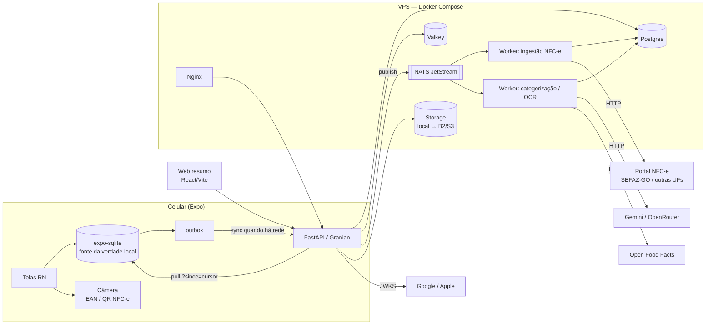

# Arquitetura — EconoMerc

## Visão geral



## Componentes

| Componente | Responsabilidade | Tecnologia |
|---|---|---|
| **App** | Todo o produto: scan, carrinho offline, orçamento, histórico, perfil | Expo SDK 57, Expo Router, expo-sqlite, expo-camera, TanStack Query |
| **Web** | Landing, histórico/gráficos, mural (leitura), admin | React 19, Vite, TanStack, shadcn, Tailwind 4 |
| **API** | Auth, catálogo, preços, sync, recepção de NFC-e, admin | FastAPI, Pydantic V2, asyncpg, Granian |
| **Workers** | Ingestão de NFC-e, OCR de etiqueta, categorização, enriquecimento via Open Food Facts | Python (mesmo pacote do backend), consumidores NATS |
| **Postgres** | Dados transacionais e histórico de preços | Postgres 17, dbmate, particionamento de `prices` por região quando crescer |
| **Valkey** | Cache (lookup de EAN quente, rate limit, sessão de sync) | Valkey 8 via UDS |
| **NATS JetStream** | Filas duráveis (ingestão, IA) com retry e dead-letter | NATS |
| **Storage** | Bruto da NFC-e (privado), fotos de etiqueta, avatares | `StorageBackend` (local NVMe → B2/S3 por config) |

## Fluxos principais

### 1. Scan de produto (online ou offline)

1. App lê EAN, valida dígito verificador.
2. Busca no SQLite (catálogo em cache da região). Achou → mostra nome/último preço.
3. Não achou e há rede → `GET /products/by-ean/{ean}?city=` (API: Postgres → Valkey → Open Food Facts).
4. Sem preço → usuário digita ou fotografa a etiqueta (`POST /ocr/price-tag`, IA de visão).
5. Item entra no carrinho local (`cart_items`, com `client_id`) + `outbox`. Total recalcula na hora.

### 2. Fechamento com NFC-e

1. App lê o QR, extrai a URL e a chave de acesso (44 dígitos).
2. `POST /receipts` `{client_id, qr_url}` → API grava `receipts(status=pending)` e publica
   `receipts.ingest` no NATS. Responde 202 na hora.
3. Worker escolhe o adaptador pela UF (2 primeiros dígitos da chave; 52 = GO), busca a página de
   consulta pública, guarda o bruto em storage privado, extrai emitente (CNPJ → `markets`), itens,
   preços, total.
4. Itens viram `receipt_items` + observações em `prices` (`source = nfce`, confiança alta).
   Produtos novos entram no catálogo; categoria por NCM/regra, IA como fallback.
5. App recebe o resultado no próximo pull e **concilia** com o carrinho (preço real vs. escaneado).

### 3. Sync offline

- Push: app drena a `outbox` → `POST /sync/push` com lote de mutações; cada uma é upsert
  idempotente por `(user_id, client_id)`; resposta traz o `server_updated_at` de cada uma.
- Pull: `GET /sync/pull?cursor=` devolve mudanças desde o cursor (inclusive tombstones).
- Conflito: last-write-wins por campo usando `updated_at` (cliente, corrigido por offset).

### 4. IA por tarefa

```yaml
# config/app/{env}.yaml
ai:
  providers:
    gemini:     { base_url: ..., api_key_env: GEMINI_API_KEY }
    openrouter: { base_url: https://openrouter.ai/api/v1, api_key_env: OPENROUTER_API_KEY }
  tasks:
    price_tag_ocr:      { provider: gemini, model: <modelo-visão>, timeout_s: 8 }
    categorize_product: { provider: openrouter, model: <modelo-barato>, timeout_s: 5 }
```

- Cliente único OpenAI-compatível (`langchain-openai`/SDK), escolhido por tarefa. Trocar de modelo
  = mudar YAML. Toda chamada loga provider, modelo, latência, tokens e custo estimado.
- Saída sempre estruturada (JSON schema / Pydantic) e validada; falha → fallback de regra ou manual.
- Cache por entrada (EAN, hash da imagem) — nunca pagar duas vezes pela mesma resposta.

### 5. Autenticação

Google e Apple: o app pega o `id_token` nativo → `POST /auth/{google|apple}` → backend valida via
JWKS (issuer, audience, exp) → cria/acha usuário → access JWT curto (memória) + refresh opaco
(SHA-256 no banco, rotação com família — skill `auth`). Web usa o mesmo backend com cookie HttpOnly.

## Hospedagem

Padrão nexarena: uma VPS com Docker Compose (`compose.yaml` + override por `ENVIRONMENT`), Nginx
na frente (`/` web, `/api` backend), Postgres sem porta pública, backups `pg_dump` noturnos.
App publicado via EAS (lojas) + EAS Update (OTA). Monitoramento externo do `/api/health`.

## Decisões registradas

| Decisão | Motivo |
|---|---|
| Expo em vez de Capacitor/PWA | Uso dentro do mercado com uma mão: sensação nativa importa; EAS compila iOS sem Mac |
| Web só resumo | O app é o produto; web não precisa de paridade |
| Backend Python | OCR, scraping de NFC-e, dados (Polars) e IA das Fases 2–3 |
| Offline-first | Sinal ruim dentro de mercado |
| NATS para ingestão | Notas em lote, retry e dead-letter sem travar a API |
| IA configurável por tarefa | Usuário tem acesso livre a vários modelos via OpenRouter |
| Sem API paga de catálogo | Base própria cresce com NFC-e + Open Food Facts |
