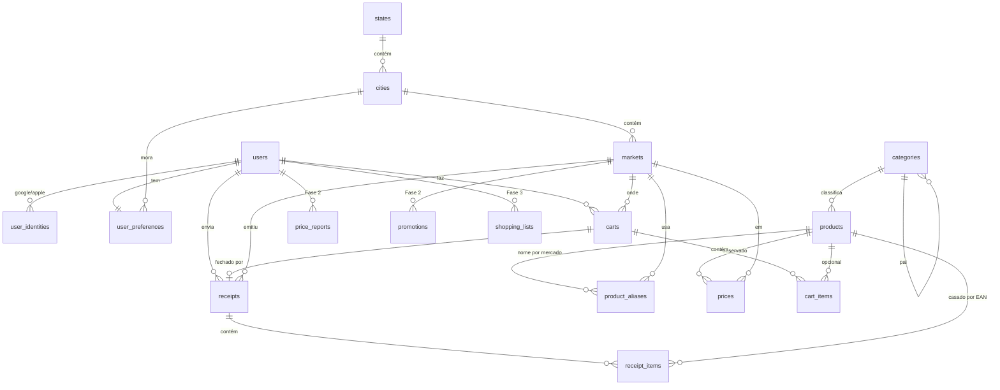

# Modelagem do banco — EconoMerc

> Esboço de planejamento. O schema real nasce em `backend/db/migrations/*.sql` (dbmate) seguindo
> a skill `database`. Convenções herdadas do nexarena:
> PK `UUID` (`gen_random_uuid()`) · `TIMESTAMPTZ` UTC · soft-delete `deleted_at` · enum-like =
> `VARCHAR` + `CHECK` · **toda FK indexada** · UNIQUE em tabela com soft-delete = índice parcial
> `WHERE deleted_at IS NULL` · dinheiro `NUMERIC(12,2)` · JSONB só para shape variável.

## Mapa

| Grupo | Tabelas | Fase |
|---|---|---|
| Identidade | `users`, `user_identities`, `user_preferences`, `refresh_tokens` | 1 |
| Geografia | `states`, `cities` | 1 |
| Mercados | `markets` | 1 |
| Catálogo | `categories`, `products`, `product_aliases` | 1 |
| Preços | `prices` | 1 |
| Compra | `carts`, `cart_items`, `budget_alerts` | 1 |
| Nota fiscal | `receipts`, `receipt_items` | 1 |
| Arquivos | `user_uploads` (`org_uploads` na Fase 2) | 1 |
| Sync | `sync_changes` (log para pull por cursor) | 1 |
| Comunidade | `promotions`, `price_reports`, `price_report_votes`, `user_points`, `badges`, `user_badges` | 2 |
| Mercados+ | `user_favorite_markets` | 2 |
| IA | `shopping_lists`, `shopping_list_items`, `recommendations` | 3 |

## Diagrama ER (Fase 1 + ganchos)



## Tabelas — Fase 1

### Identidade

```sql
CREATE TABLE users (
  id            UUID PRIMARY KEY DEFAULT gen_random_uuid(),
  email         VARCHAR(320),                 -- Apple pode ocultar (relay); pode ser NULL
  display_name  VARCHAR(120),
  avatar_upload_id UUID,                      -- FK para user_uploads (criada depois)
  role          VARCHAR(20) NOT NULL DEFAULT 'user' CHECK (role IN ('user','moderator','admin')),
  last_login_at TIMESTAMPTZ,
  created_at    TIMESTAMPTZ NOT NULL DEFAULT now(),
  updated_at    TIMESTAMPTZ NOT NULL DEFAULT now(),
  deleted_at    TIMESTAMPTZ
);

CREATE TABLE user_identities (               -- 1 usuário, N provedores
  id           UUID PRIMARY KEY DEFAULT gen_random_uuid(),
  user_id      UUID NOT NULL REFERENCES users(id),
  provider     VARCHAR(10) NOT NULL CHECK (provider IN ('google','apple')),
  subject      VARCHAR(255) NOT NULL,         -- claim "sub" do id_token
  created_at   TIMESTAMPTZ NOT NULL DEFAULT now(),
  UNIQUE (provider, subject)
);
CREATE INDEX ON user_identities (user_id);

CREATE TABLE user_preferences (
  user_id              UUID PRIMARY KEY REFERENCES users(id),
  city_id              UUID REFERENCES cities(id),
  household_size       SMALLINT CHECK (household_size BETWEEN 1 AND 20),
  monthly_budget       NUMERIC(12,2) CHECK (monthly_budget >= 0),
  budget_alert_percent SMALLINT NOT NULL DEFAULT 90 CHECK (budget_alert_percent BETWEEN 50 AND 100),
  interest_category_ids UUID[] NOT NULL DEFAULT '{}',
  updated_at           TIMESTAMPTZ NOT NULL DEFAULT now()
);
CREATE INDEX ON user_preferences (city_id);
-- refresh_tokens: contrato da skill `auth` (opaco, SHA-256, família, claim_if_unused).
```

### Geografia e mercados

```sql
CREATE TABLE states (
  code     CHAR(2) PRIMARY KEY,               -- 'GO'
  ibge_code SMALLINT NOT NULL UNIQUE,         -- 52 (= 2 primeiros dígitos da chave da NFC-e)
  name     VARCHAR(60) NOT NULL
);

CREATE TABLE cities (
  id         UUID PRIMARY KEY DEFAULT gen_random_uuid(),
  state_code CHAR(2) NOT NULL REFERENCES states(code),
  ibge_code  INTEGER NOT NULL UNIQUE,         -- Catalão = 5205109
  name       VARCHAR(120) NOT NULL,
  is_active  BOOLEAN NOT NULL DEFAULT false   -- cobertura ligada
);
CREATE INDEX ON cities (state_code);

CREATE TABLE markets (
  id          UUID PRIMARY KEY DEFAULT gen_random_uuid(),
  city_id     UUID NOT NULL REFERENCES cities(id),
  cnpj        CHAR(14),                       -- emitente da NFC-e; NULL se cadastrado à mão
  legal_name  VARCHAR(200),
  trade_name  VARCHAR(200) NOT NULL,
  address     VARCHAR(300),
  latitude    NUMERIC(9,6),
  longitude   NUMERIC(9,6),
  is_partner  BOOLEAN NOT NULL DEFAULT false,
  created_at  TIMESTAMPTZ NOT NULL DEFAULT now(),
  updated_at  TIMESTAMPTZ NOT NULL DEFAULT now(),
  deleted_at  TIMESTAMPTZ
);
CREATE INDEX ON markets (city_id);
CREATE UNIQUE INDEX markets_cnpj_uq ON markets (cnpj) WHERE deleted_at IS NULL AND cnpj IS NOT NULL;
```

### Catálogo

```sql
CREATE TABLE categories (
  id        UUID PRIMARY KEY DEFAULT gen_random_uuid(),
  parent_id UUID REFERENCES categories(id),
  slug      VARCHAR(60) NOT NULL UNIQUE,      -- 'laticinios', 'hortifruti', ...
  name      VARCHAR(80) NOT NULL,
  ncm_prefixes VARCHAR(8)[] NOT NULL DEFAULT '{}',  -- regra de categorização por NCM
  position  SMALLINT NOT NULL DEFAULT 0
);
CREATE INDEX ON categories (parent_id);

CREATE TABLE products (
  id            UUID PRIMARY KEY DEFAULT gen_random_uuid(),
  ean           VARCHAR(14),                  -- chave natural (GTIN-8/12/13/14); NULL p/ granel sem código
  name          VARCHAR(200) NOT NULL,        -- nome canônico normalizado
  brand         VARCHAR(120),
  category_id   UUID REFERENCES categories(id),
  category_source VARCHAR(10) CHECK (category_source IN ('ncm','rule','ai','manual')),
  ncm           CHAR(8),
  unit          VARCHAR(4) NOT NULL DEFAULT 'un' CHECK (unit IN ('un','kg','g','l','ml')),
  net_quantity  NUMERIC(10,3),                -- 500 (g), 1 (l)... base do R$/kg, R$/L
  image_upload_id UUID,
  off_synced_at TIMESTAMPTZ,                  -- último enriquecimento Open Food Facts
  created_at    TIMESTAMPTZ NOT NULL DEFAULT now(),
  updated_at    TIMESTAMPTZ NOT NULL DEFAULT now(),
  deleted_at    TIMESTAMPTZ
);
CREATE UNIQUE INDEX products_ean_uq ON products (ean) WHERE deleted_at IS NULL AND ean IS NOT NULL;
CREATE INDEX ON products (category_id);
CREATE INDEX products_name_trgm ON products USING gin (name gin_trgm_ops);  -- busca por nome (pg_trgm)

CREATE TABLE product_aliases (              -- como cada mercado chama o produto na NFC-e
  id          UUID PRIMARY KEY DEFAULT gen_random_uuid(),
  product_id  UUID NOT NULL REFERENCES products(id),
  market_id   UUID REFERENCES markets(id),
  market_code VARCHAR(60),                   -- código interno do item no mercado (cProd)
  raw_name    VARCHAR(200) NOT NULL,
  created_at  TIMESTAMPTZ NOT NULL DEFAULT now(),
  UNIQUE (market_id, market_code)
);
CREATE INDEX ON product_aliases (product_id);
```

### Preços (coração da base proprietária)

```sql
CREATE TABLE prices (
  id           UUID NOT NULL DEFAULT gen_random_uuid(),
  product_id   UUID NOT NULL REFERENCES products(id),
  market_id    UUID NOT NULL REFERENCES markets(id),
  city_id      UUID NOT NULL REFERENCES cities(id),   -- denormalizado: chave de partição
  amount       NUMERIC(12,2) NOT NULL CHECK (amount > 0),
  unit_amount  NUMERIC(12,4),                          -- R$/kg ou R$/L calculado
  is_promotion BOOLEAN NOT NULL DEFAULT false,
  source       VARCHAR(10) NOT NULL CHECK (source IN ('nfce','community','flyer','manual','partner')),
  confidence   NUMERIC(3,2) NOT NULL CHECK (confidence BETWEEN 0 AND 1),
  source_ref_id UUID,                                  -- receipt_item / price_report / ...
  reported_by  UUID REFERENCES users(id),
  observed_at  TIMESTAMPTZ NOT NULL,                   -- quando o preço valia (data da nota)
  created_at   TIMESTAMPTZ NOT NULL DEFAULT now(),
  PRIMARY KEY (city_id, id)
);  -- começar sem partição; virar PARTITION BY LIST (city_id) quando o volume pedir
CREATE INDEX prices_lookup ON prices (product_id, city_id, observed_at DESC, id);
CREATE INDEX ON prices (market_id);
CREATE INDEX ON prices (reported_by);
-- "preço atual" = último por (produto, mercado) com observed_at > now() - 15 days (senão: desatualizado).
-- Materialized view `current_prices` se a consulta ficar cara.
```

Confiança inicial por fonte (ajustável): `nfce` 0.95 · `partner` 0.9 · `flyer` 0.8 · `community`
0.6 (sobe com votos/reputação) · `manual` 0.4 (preço digitado só serve ao próprio carrinho até ser
confirmado).

### Compra (offline-first)

```sql
CREATE TABLE carts (
  id           UUID PRIMARY KEY DEFAULT gen_random_uuid(),
  user_id      UUID NOT NULL REFERENCES users(id),
  client_id    UUID NOT NULL,                  -- gerado no app
  market_id    UUID REFERENCES markets(id),
  status       VARCHAR(10) NOT NULL DEFAULT 'open' CHECK (status IN ('open','closed','abandoned')),
  budget_limit NUMERIC(12,2),
  total_amount NUMERIC(12,2) NOT NULL DEFAULT 0,
  started_at   TIMESTAMPTZ NOT NULL,
  closed_at    TIMESTAMPTZ,
  client_updated_at TIMESTAMPTZ NOT NULL,       -- LWW
  created_at   TIMESTAMPTZ NOT NULL DEFAULT now(),
  updated_at   TIMESTAMPTZ NOT NULL DEFAULT now(),
  deleted_at   TIMESTAMPTZ,
  UNIQUE (user_id, client_id)
);
CREATE INDEX ON carts (market_id);
CREATE INDEX carts_user_recent ON carts (user_id, started_at DESC, id);

CREATE TABLE cart_items (
  id          UUID PRIMARY KEY DEFAULT gen_random_uuid(),
  cart_id     UUID NOT NULL REFERENCES carts(id),
  user_id     UUID NOT NULL REFERENCES users(id),  -- escopo do upsert idempotente
  client_id   UUID NOT NULL,
  product_id  UUID REFERENCES products(id),        -- NULL se item manual sem EAN
  ean         VARCHAR(14),
  name        VARCHAR(200) NOT NULL,
  category_id UUID REFERENCES categories(id),
  quantity    NUMERIC(10,3) NOT NULL DEFAULT 1 CHECK (quantity > 0),
  unit_price  NUMERIC(12,2) NOT NULL CHECK (unit_price >= 0),
  price_source VARCHAR(10) NOT NULL CHECK (price_source IN ('catalog','ocr','manual','nfce')),
  field_updated_at JSONB NOT NULL DEFAULT '{}',   -- {"quantity": ts, "unit_price": ts} p/ LWW por campo
  created_at  TIMESTAMPTZ NOT NULL DEFAULT now(),
  updated_at  TIMESTAMPTZ NOT NULL DEFAULT now(),
  deleted_at  TIMESTAMPTZ,
  UNIQUE (user_id, client_id)
);
CREATE INDEX ON cart_items (cart_id);
CREATE INDEX ON cart_items (product_id);
CREATE INDEX ON cart_items (category_id);

CREATE TABLE budget_alerts (
  id         UUID PRIMARY KEY DEFAULT gen_random_uuid(),
  user_id    UUID NOT NULL REFERENCES users(id),
  cart_id    UUID REFERENCES carts(id),
  kind       VARCHAR(20) NOT NULL CHECK (kind IN ('cart_threshold','cart_exceeded','monthly_threshold','monthly_exceeded')),
  triggered_at TIMESTAMPTZ NOT NULL DEFAULT now()
);
CREATE INDEX ON budget_alerts (user_id);
CREATE INDEX ON budget_alerts (cart_id);
```

### Nota fiscal (NFC-e)

```sql
CREATE TABLE receipts (
  id            UUID PRIMARY KEY DEFAULT gen_random_uuid(),
  user_id       UUID NOT NULL REFERENCES users(id),
  client_id     UUID NOT NULL,
  cart_id       UUID REFERENCES carts(id),
  access_key    CHAR(44) NOT NULL,             -- chave de acesso
  state_code    CHAR(2) NOT NULL REFERENCES states(code),
  qr_url        TEXT NOT NULL,
  status        VARCHAR(12) NOT NULL DEFAULT 'pending'
                CHECK (status IN ('pending','processing','parsed','failed','duplicate')),
  failure_reason VARCHAR(200),
  attempts      SMALLINT NOT NULL DEFAULT 0,
  market_id     UUID REFERENCES markets(id),
  issued_at     TIMESTAMPTZ,
  total_amount  NUMERIC(12,2),
  discount_amount NUMERIC(12,2),
  raw_upload_id UUID,                           -- HTML/XML bruto em storage PRIVADO (pode ter CPF)
  created_at    TIMESTAMPTZ NOT NULL DEFAULT now(),
  updated_at    TIMESTAMPTZ NOT NULL DEFAULT now(),
  UNIQUE (user_id, client_id)
);
CREATE UNIQUE INDEX receipts_access_key_uq ON receipts (access_key)
  WHERE status <> 'duplicate';                  -- mesma nota enviada por 2 pessoas conta 1 vez
CREATE INDEX ON receipts (user_id, created_at DESC, id);
CREATE INDEX ON receipts (cart_id);
CREATE INDEX ON receipts (market_id);
CREATE INDEX ON receipts (state_code);

CREATE TABLE receipt_items (
  id          UUID PRIMARY KEY DEFAULT gen_random_uuid(),
  receipt_id  UUID NOT NULL REFERENCES receipts(id),
  line_number SMALLINT NOT NULL,
  market_code VARCHAR(60),                     -- código do item no mercado
  ean         VARCHAR(14),                     -- quando a nota traz GTIN
  raw_name    VARCHAR(200) NOT NULL,
  ncm         CHAR(8),
  quantity    NUMERIC(10,3) NOT NULL,
  unit        VARCHAR(6),
  unit_price  NUMERIC(12,2) NOT NULL,
  total_price NUMERIC(12,2) NOT NULL,
  product_id  UUID REFERENCES products(id),    -- resolvido por EAN ou alias
  UNIQUE (receipt_id, line_number)
);
CREATE INDEX ON receipt_items (product_id);
```

### Arquivos e sync

- `user_uploads`: contrato da skill `uploads-storage` (`owner_user_id`, `kind` em
  `('price_tag_photo','receipt_raw','avatar')`, `visibility`). `receipt_raw` é sempre `private`.
- `sync_changes (id BIGSERIAL, user_id, entity, entity_id, op, changed_at)` — log append-only
  por usuário; o cursor do pull é o `id`. Alimentado na mesma transação da escrita.

## Ganchos — Fase 2 (não criar agora, só não bloquear)

| Tabela | Campos-chave |
|---|---|
| `promotions` | `market_id`, `product_id?`, `title`, `promo_price`, `regular_price?`, `valid_from`, `valid_until`, `source` (`flyer`/`partner`/`community`), `city_id` |
| `price_reports` | `user_id`, `product_id`, `market_id`, `amount`, `photo_upload_id`, `status` (`pending`/`accepted`/`rejected`/`outlier`), `observed_at` → aceito vira linha em `prices` |
| `price_report_votes` | `report_id`, `user_id`, `vote` (`confirm`/`dispute`), UNIQUE (report, user) |
| `user_points` | ledger append-only: `user_id`, `reason`, `points`, `ref_id` |
| `badges` / `user_badges` | catálogo de emblemas / conquistas |
| `user_favorite_markets` | `user_id`, `market_id` |

## Ganchos — Fase 3

| Tabela | Campos-chave |
|---|---|
| `shopping_lists` / `shopping_list_items` | lista desejada (produto ou texto livre + quantidade), offline-first com `client_id` |
| `recommendations` | `list_id`, plano gerado (JSONB: mercado por item, total, economia estimada), `model`, `created_at` |

Previsão de preço e relatório de economia leem de `prices` + `carts`/`receipts` — sem tabela nova
até provar necessidade (Polars/DuckDB em cima do Postgres).

## Decisões em aberto

- Particionar `prices` por `city_id` desde o dia 1 ou só quando passar de ~10M linhas (proposta: depois).
- Granel sem EAN (hortifruti): produto por `(market_id, market_code)` via alias ou produto genérico por categoria.
